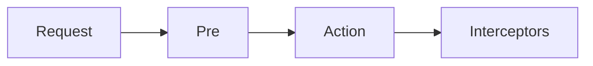
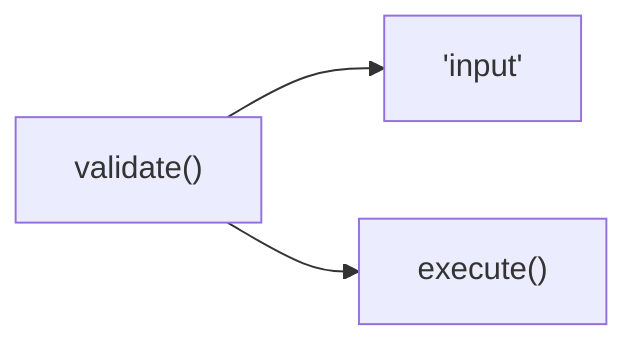

# Struts

Struts config file appear to allow enum setting



# Results

## `redirect`

```xml
<result name="redirect" type="redirect">
  <param name="statusCode">307</param>
  <param name="location">${redirectUrl}</param>
</result>
```

- Given that the user is on `/path`
- If `redirectUrl` is `/test` , the user will be redirected to `/test`
- If `redirectUrl` is `test` , the user will be redirected to `/path/test`

## `redirectAction`

```xml
<result name="redirect" type="redirectAction">
  <param name="statusCode">307</param>
  <param name="actionName">${redirectUrl}</param>
</result>
```

- `redirectUrl` can be empty

# JSP

- “value”: value on the value stack
- “#value”: value not on the value stack
- “%{expression}”: evaluate “expression” rather than treat it as “string”

# Tags

- `key`: a shortcut to set name and label at the same time (See
  [UIBean.java](https://github.com/apache/struts/blob/90f984ca85f102ea48ce42944cbe460c74484566/core/src/main/java/org/apache/struts2/components/UIBean.java#L654-L664))

# JSON

JSON interceptor matches JSON properties to action class properties.

```text
{
  "name": "Peter",
  "age": 23
}

public class SubmitAction {
  public void setName(String name) {}
  public void setAge(Integer age) {}
}
```

- As of version 2.5, the type of the model must have an empty constructor:
  `Class.newInstance` cannot construct classes without empty constructors

# Actions



- [Struts 2 instantiates a new action class per request](https://struts.staged.apache.org/migration/)

## Properties

- `Optional<T>` properties might not be serialized properly
  - Ex. `Optional<JsonObject>` might not be serialized into `{ ... }`, and
    instead be serialized into `Optional[{ ... }]`
-
